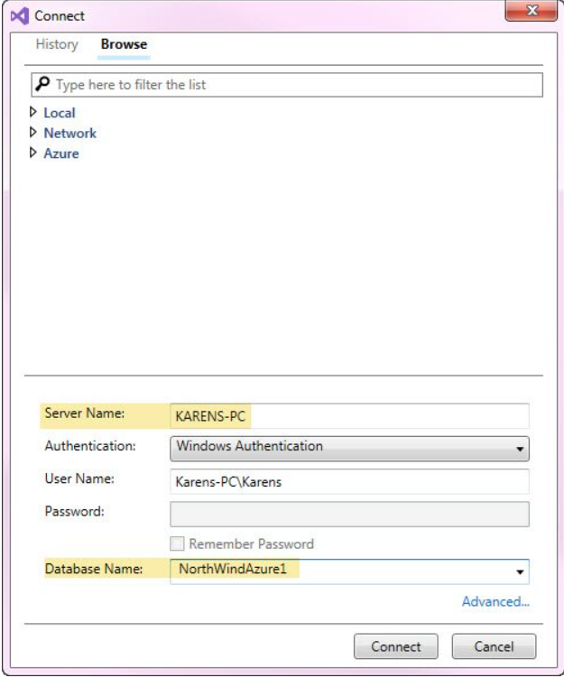

# About Writing SQL for your application

Common practice for developers is to write SQL statements directly in code using SELECT * FROM some table, run the SQL using a connection and command objects and get unexpected results back. This article will provide methods for writing SQL statements outside of code along with creating a unit test to ensure when placing SQL statements into code if unexpected results are returned they can be attributed to improperly written code.

</br>


</br>


:heavy_check_mark: Originally written in VS2017, now VS2019

:heavy_check_mark: SQL-Server is used while the same applies for all databases

:heavy_check_mark: Uses .NET Framework, same applies for .NET Core

</br>

# Common mistakes

- Spaces in colum names, avoid using spaces in column names, instead leave presenting column names in the applicaton or alias column names.
- Not using parameters which can lead to data mismatch and/or unescaped single quotes
- Failing to review your data model
- Failing to test your queries

</br>

# Writing SQL statements outside of code

Before creating SQL statements you should determine what information needs to be returned. This requires business requirements rather than simply writing SQL statements.

For example, if our requirement is to get the data of all Products from an ordering system (using Microsoft NorthWind database Jump as a sample), then we can use a SELECT statement as below:

```sql
SELECT ProductID
      ,ProductName
      ,SupplierID
      ,CategoryID
      ,QuantityPerUnit
      ,UnitPrice
      ,UnitsInStock
      ,UnitsOnOrder
      ,ReorderLevel
      ,Discontinued
      ,DiscontinuedDate
  FROM dbo.Products
```
Note there is a category identifier which means products are broken down by category. Most likely the user of this system wants to filter by category so we need a query for this.

```sql
SELECT CategoryID
      ,CategoryName
      ,Description
  FROM dbo.Categories
```

Now instead of showing all products provide a ListBox or ComboBox to select categories from. The user selects a category by category name, your code obtains the Category identifier and queries for that category.

Write the SQL statement

```sql
DECLARE @CategoryIdentifier AS INT = 1
SELECT ProductID
      ,ProductName
      ,SupplierID
      ,CategoryID
      ,QuantityPerUnit
      ,UnitPrice
      ,UnitsInStock
      ,UnitsOnOrder
      ,ReorderLevel
      ,Discontinued
      ,DiscontinuedDate
  FROM NorthWindAzure1.dbo.Products
  WHERE ProductID = @CategoryIdentifier
```

# How to create the SQL outside of code

Using [SQL-Server Management Studio](https://docs.microsoft.com/en-us/sql/ssms/sql-server-management-studio-ssms?view=sql-server-ver15) create a new query. Write the code as shown above and execute. This is very simple and works but suppose you don't have SQL-Server Management Studio?

Inside of Visual Studio

- Display Server Explorer (see figure 1)
- Select Data Connections
- Right-click and select add a new connection.
- Configure the connection e.g. server name followed by database name (see figure 2)
- Test the connection.
- Save.
- Once the server is displayed right click and select `new query`
- Write the SQL.
- When writing the query if using VS2017 SQL-Prompt addin will assist with field names
- Execute the query using the green arrow button in the query toolbar.

**Figure 1**


**Figure 2**

In this case `Server Name` is pointing to a non-express version of SQL-Server. For SQL-Express use `.\SQLEXPRESS`.



Once everything checks out it's time to implement the query into code. The DECLARE variable will become a parameter for the command object.

# Unit Testing


Once the code has been written create a unit test project and test methods written for the SQL. There should be a positive and negative test. Below is the ordering sample there are unit test methods to learn from.

By viewing Test Explorer (accessed under test, windows you can run and view the unit test.


## Example

You are tasked with creating an ordering system where a person will order a product where the quantity can be 1 or many. Using the concept above first write code in Visual Studio editor.

We have a Product table as per above. We must first check to see if there are enough of a product to place the order and then if there are deduct the amount to be ordered from the current in-stock quantity. If the quantity to order is greater than in stock the product cannot be ordered. There are several other considerations involved in this process but here we will keep things at this level for learning purposes.

```sql
DECLARE @Id AS INT = 2;
DECLARE @OrderAmount AS INT = 2;
DECLARE @UpdateInStock AS INT = 0;
BEGIN TRANSACTION
DECLARE @InStock AS INT = (SELECT  UnitsInStock FROM dbo.Products WHERE ProductID = @Id);
 
PRINT 'Current stock ' + CAST(@InStock AS VARCHAR(5));
 
--- determine if the order can be placed
IF @InStock > @OrderAmount
    BEGIN  
        --- order can be replace so set the value for the UPDATE statement
        SET @UpdateInStock = @InStock - @OrderAmount;
 
        PRINT 'Updated amount ' + CAST(@UpdateInStock AS VARCHAR(5));
 
        --- update
        UPDATE dbo.Products SET UnitsInStock = @UpdateInStock WHERE ProductID = @Id;
 
        --- show current stock for confirmation
        SET @InStock =  (SELECT  UnitsInStock FROM dbo.Products WHERE ProductID = @Id);
 
        PRINT 'Current stock after update ' + CAST(@InStock AS VARCHAR(5));
 
    END
ELSE PRINT 'Not enough stock to place order!!!'
 
ROLLBACK TRANSACTION
 
SET @InStock = (SELECT  UnitsInStock FROM dbo.Products WHERE ProductID = @Id);
PRINT 'Current stock after operations ' + CAST(@InStock AS VARCHAR(5));
```

In the above SQL statements, there are variables for the product primary key, order amount and a variable for math. The first statement gets them in stock quantity for the product the checks to see if there are enough in stock to order. If there are enough in stock subtract order quantity from current quantity and update the quantity in the table. If there are not enough in stock, in this case, simple display this to the output window.

Finally, roll back changes which are possible by wrapping the statements in a transaction which means if there are no errors in the code and the in stock quantity has been altered return the quantity to which is was prior to the UPDATE statement running.

If satisfied with the results code can be written.


# Turn SQL into data operations

Create a class project for working with the SQL-Server database table. The first part is to create two classes, one for exceptions and one responsible for connecting to the database.

It's highly suggested to have a test database rather than running the following on a production database. 

Create a new class project named DataOperations followed by creating a new class with the following enumeration.

```csharp
namespace DataOperations
{
    public enum DataOperationStatus
    {
        UpdateSuccessfully,
        InsufficientQuantity,
        RuntimeExceptionThrown,
        NotFound
    }
}
```

Create a class named BackEnd (or your choice for a name).

```csharp
using System;
using System.Data.SqlClient;
using DataConnections;
 
namespace DataOperations
{
    public class Backend : BaseSqlServerConnection
    {
        public Backend()
        {
            mHasException = false;
        }
        public DataOperationStatus PlaceOrder(int pProductIdentifier, int pOrderAmount)
        {
            using (SqlConnection cn = new SqlConnection() {ConnectionString = ConnectionString})
            {
                using (SqlCommand cmd = new SqlCommand() {Connection = cn})
                {
 
                    try
                    {
                        cn.Open();
 
                        cmd.Parameters.AddWithValue("@Id", pProductIdentifier);
 
                        // determine if product currently exists
                        cmd.CommandText = "SELECT COUNT(ProductID) " +
                                          "FROM dbo.Products " +
                                          "WHERE ProductID = @Id";
 
                        var locateResult = Convert.ToInt32(cmd.ExecuteScalar());
 
                        if (locateResult == 0)
                        {
                            return DataOperationStatus.NotFound;
                        }
 
 
                        cmd.CommandText = "SELECT UnitsInStock " +
                                          "FROM dbo.Products " +
                                          "WHERE ProductID = @Id";
 
                        var inStock = Convert.ToInt16(cmd.ExecuteScalar());
 
                        if (inStock > pOrderAmount)
                        {
                            cmd.CommandText = "UPDATE dbo.Products " +
                                              "SET UnitsInStock = @UpdateInStock " +
                                              "WHERE ProductID = @Id";
 
                            int updateStock = inStock - pOrderAmount;
                            cmd.Parameters.AddWithValue("@UpdateInStock", updateStock);
                            Console.WriteLine(cmd.ExecuteNonQuery());
                            return DataOperationStatus.UpdateSuccessfully;
                        }
                        else
                        {
                            return DataOperationStatus.InsufficientQuantity;
                        }
                    }
                    catch (Exception ex)
                    {
                        mHasException = true;
                        mLastException = ex;
                        return DataOperationStatus.RuntimeExceptionThrown;
                    }
                }
            }
        }
    }
}
```

# Writing unit test for above code

- Create a new unit test project named DataUnitTest in your current solution.
- Add project references for the DataConnection, DataOperations and Exception libraries.
- Create a new folder in this project named BaseClasses.
- Create TestBase class in BaseClasses folder.
- Replace TestBase contents with the following and note BaseClass inherits BaseSqlServerConnection which is the same as in the DataOperations class meaning connections are done the same for both projects.


The private variable OrderTestNameList will be used in another class which inherits this class for resetting a row in the database table before and after each unit test method runs. The variable TestContextInstance provide the ability for determining which test is about to run in the unit test class that follows.


The method ResetProduct is responsible for returning the product to the state we want.

```csharp
using System.Collections.Generic;
using System.Data.SqlClient;
using DataConnections;
using Microsoft.VisualStudio.TestTools.UnitTesting;
 
namespace DataUnitTest.BaseClasses
{
    public class Testbase : BaseSqlServerConnection
    {
        /// <summary>
        /// Any test method with one of these names will
        /// reset product specified in the Init method
        /// of the unit test to a specific in stock amount.
        /// </summary>
        /// <remarks>
        /// Fragile in respects if a test method name changes.
        /// </remarks>
        protected List<string> OrderTestNameList = new List<string>()
        {
            "OrderProduct_Stocked",
            "OrderProduct_UnderStock",
            "ProductDoesNotExists"
        };
 
        protected TestContext TestContextInstance;
        public TestContext TestContext
        {
            get => TestContextInstance;
            set => TestContextInstance = value;
        }
        public void ResetProduct(int pProductIdentifier, int pQuantity)
        {
            using (SqlConnection cn = new SqlConnection() {ConnectionString = ConnectionString})
            {
                using (SqlCommand cmd = new SqlCommand() {Connection = cn})
                {
 
                    cmd.CommandText = "UPDATE dbo.Products " +
                                      "SET UnitsInStock = @UpdateInStock " +
                                      "WHERE ProductID = @Id";
 
                    cmd.Parameters.AddWithValue("@Id", pProductIdentifier);
                    cmd.Parameters.AddWithValue("@UpdateInStock", pQuantity);
 
                    cn.Open();
 
                    cmd.ExecuteNonQuery();
 
                }
            }
        }
    }
}
```

Create a unit test class in the test project with a name of ProductTest. Populate the class with the following.

```csharp
using DataOperations;
using DataUnitTest.BaseClasses;
using Microsoft.VisualStudio
    .TestTools.UnitTesting;
 
namespace DataUnitTest
{
    [TestClass]
    public class ProductTest : Testbase
    {
        // product primary key to test
        private int _productIdentifier = 2;
 
        // in stock quantity to begin with
        private int _ResetProductQuantityToo = 20;
 
        /// <summary>
        /// Run before each test runs
        /// Reset in stock quanitity to fixed amount
        /// </summary>
        [TestInitialize]
        public void Init()
        {
            if (OrderTestNameList.Contains(TestContext.TestName))
            {
                ResetProduct(_productIdentifier, _ResetProductQuantityToo);
            }
        }
        /// <summary>
        /// Run after each test has completed.
        /// Reset in stock quanitity to fixed amount
        /// </summary>
        [TestCleanup]
        public void MethodCleanUp()
        {
            if (OrderTestNameList.Contains(TestContext.TestName))
            {
                ResetProduct(_productIdentifier, _ResetProductQuantityToo);
            }
        }
        /// <summary>
        /// Test to ensure a product can be ordered when there is
        /// sufficient stock.
        /// </summary>
        [TestMethod]
        public void OrderProduct_Stocked()
        {
            // arrange
            var productIdentifier = _productIdentifier;
            var orderAmount = 2;
 
            // act
            var ops = new Backend();
            var results = ops.PlaceOrder(productIdentifier, orderAmount);
 
            // assert
            Assert.IsTrue(results == DataOperationStatus.UpdateSuccessfully,
                "Expected update successful");
        }
        /// <summary>
        /// Test the production code handles Insufficient quantity
        /// </summary>
        [TestMethod]
        public void OrderProduct_UnderStock()
        {
            // arrange
            var productIdentifier = _productIdentifier;
            var orderAmount = _ResetProductQuantityToo + 2;
 
            // act
            var ops = new Backend();
            var results = ops.PlaceOrder(productIdentifier, orderAmount);
 
            // assert
            Assert.IsTrue(results == DataOperationStatus.InsufficientQuantity,
                "Expected update to fail");
        }
        /// <summary>
        /// Test that non existing products are handled
        /// </summary>
        /// <remarks>
        /// Within the application products should be selected from
        /// a valid list yet there may be cases that this does not happen
        /// </remarks>
        [TestMethod]
        public void ProductDoesNotExists()
        {
            // arrange
            var productIdentifier = -1;
            var orderAmount = _ResetProductQuantityToo + 2;
 
            // act
            var ops = new Backend();
            var results = ops.PlaceOrder(productIdentifier, orderAmount);
 
            // assert
            Assert.IsTrue(results == DataOperationStatus.NotFound,
                "Expected product to not exists");
        }
    }
}
```

Run the test to ensure everything in the DataOperations class project works.

# Writing code in the user interface

Now it's time to write code which calls methods in the DataOperations class. For instance, populate a ComboBox with a list of categories followed by writing code perhaps in a button click event to return data and populate a DataGridView. If there are unexpected results first run the unit test methods and if they work as expected it'd time to first examine code visually to detect logic errors. If nothing sticks out it's time to set break-points in the code and step through the code while examining values in the Visual Studio local window.

# Summary

Writing SQL on the fly within your project code can work fine yet writing code from outside of the project code in tangent with unit test methods ensures your SQL is sound plus the unit test methods ensure you backend database code works. Of course, there are always unknown facts which can spring up and if and when they do you can first run the unit test rather than attempt to reproduce what a user did in the code to rule out issues with backend code. If the unit test work this may lead to an issue with the user interface code. 

# Setting up to run code

- Create a database named NorthWindAzure1
- Run script.sql in the root folder for source code
- Build the solution
- From Test Explorer, run the test


 